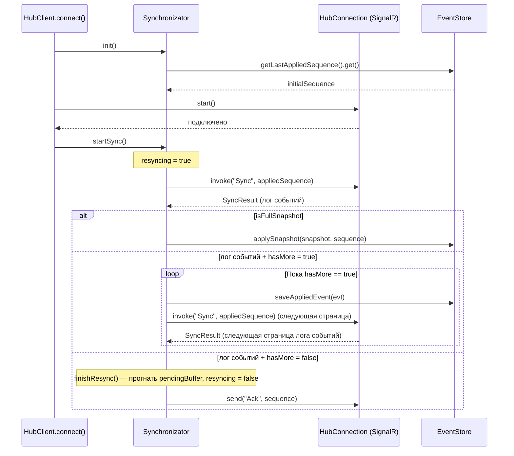

# petchat-client-api

Java-библиотека для общения с PetChat API Server: API-клиент (`PetChatApiClient`) + 
SignalR-клиент с встроенной логикой синхронизации (`HubClient`). 
Используется Android-клиентом, но не зависит от Android SDK.

## Стек

- **SignalR Java Client** (`com.microsoft.signalr`) — realtime-соединение
- **Apache HttpClient5** — транспорт для HTTP (`PetChatApiClient`)
- **Gson** / **Jackson** — сериализация (Gson — HTTP-слой и SignalR-протокол,
  Jackson — разбор `payloadJson` конкретных типов событий `UserEvent`)
- **slf4j** — логирование

## Ключевая структура

```
apiclient/
  PetChatApiClient.java      API клиент
  AbstractApiAction.java     базовый класс группы методов (Sync, Chats, Fcm,...)
  AbstractQueryBuilder.java  билдер параметров запроса
  ApiRequest.java            выполнение и валидация запроса
actions/ , queries/          конкретные методы API (auth, sync, chats, fcm, users)
objects/                     DTO объекты
signalrclient/
  HubClient.java             SignalR клиент
  BackoffRetry.java          механизм растущей с каждой попыткой задержки для реконнекта/ресинхронизации
  synchronization/
    Synchronizator.java      вся логика клиентской синхронизации
    SyncState.java           отражает состояние синхронизации
  external/
    EventStore.java          контракт хранилища, который должен реализовать сам клиент
httpclient/
  HttpClient.java            интерфейс транспорта
  ApacheHttpClient.java      реализация поверх Apache HttpClient5
```

---

## `EventStore` — контракт для хост-приложения

Библиотека не хранит данные сама — она требует от хоста реализовать три метода:

```java
public interface EventStore {
    CompletableFuture<Void> saveAppliedEvent(UserEvent evt);
    CompletableFuture<Long> getLastAppliedSequence();
    CompletableFuture<Void> applySnapshot(UserSnapshot snapshot, long sequence);
}
```

`getLastAppliedSequence()` должен отражать **только то, что сохранено на диске**. 

## `Synchronizator` — логика клиентской синхронизации



### Буферизация live-событий во время синхронизации

Пока `resyncing == true`, `Synchronizator.handleEvent` не применяет события сразу, а копит их 
в `SyncState.pendingBuffer`, тем самым не мешая процессу синхронизации закончить свое дело.
Событие не теряется и применяется сразу после `finishResync()`.

### Идемпотентность

`applyAndPersist` сравнивает `evt.sequence` с уже применённым `syncState.appliedSequence` — 
попытка повторной обработки одного и того же события не будет применена.

### Эфемерные события (`Sequence == -1`)

Сервер размечает события, не попадающие в лог маркером `Sequence = -1`. 
Такие события **не сохраняются** через `EventStore` и **не влияют** на `appliedSequence` — 
они доставляются наблюдателям (`HubClient.UserEventPublisher`) для отображении в UI.

### `Ack` — только после реального сохранения

`sendAckIfChanged()` вызывается по таймеру (раз в 5 секунд, таймер лежит в`HubClient`-конструкторе) 
и берёт значение **из `EventStore.getLastAppliedSequence()`** — это гарантирует, что сервер не
получит подтверждение раньше, чем данные были записаны на диск.

### Оповещение о новых событиях для UI-наблюдателей 

`userEventPublisher.submit(evt)` уведомляются сразу при получении события, не дожидаясь
завершения `saveAppliedEvent(evt)` для отзывчивости интерфейса. Даже если возникнет ошибка при
выполнении `saveAppliedEvent(evt)`, `sequence` не будет записан и событие можно будет получить при 
следующей синхронизации.

## `BackoffRetry`

Механизм растущей с каждой попыткой задержки (1с → 2с → 5с → 10с → 30с), используется 
для реконнекта `HubConnection` (`HubClient.scheduleReconnect`) и для повторных попыток `Sync` 
при сетевой ошибке (`Synchronizator.syncBackoff`).

## Обновление токена

`HubClient` не хранит строку токена — принимает `Supplier<String> tokenSupplier`
и вызывает его **при каждой** попытке (пере)подключения:

```java
private HubConnection buildConnection() {
    return HubConnectionBuilder
            .create(serverAddr + HUB_ENDPOINT)
            .withHeader("Authorization", "Bearer " + tokenSupplier.get())
            .build();
}
```

SignalR не даёт поменять заголовки уже собранного `HubConnection` — `scheduleReconnect` 
необходимо не переиспользовать старое соединение, а полностью пересобирать его через `buildConnection()`
(получая актуальный токен) и передавать `Synchronizator` через `rebindConnection(...)`. 
Реконнект транспорта не влияет на состояние синхронизации.

```java
connectionBackoff.schedule(() -> {
    HubConnection fresh = buildConnection();
    registerHandlers(fresh);
    this.hubConnection = fresh;
    synchronizator.rebindConnection(fresh);
    ...
});
```

---

## API

Симметрично серверу методы называются `{action}.{method}` (`sync.sync`, `creditionals.auth`, `chats.getHistory`),
GET используется по умолчанию независимо от того, мутирует ли запрос данные.

`AbstractQueryBuilder.essentialKeys()` — обязательные параметры конкретного
запроса; `build()` бросает `IllegalArgumentException`, если хотя бы один не
задан — проверка на этапе сборки запроса, до выполнения запроса в сети.

Обработка HTTP-ошибок (`ApiRequest.executeAsClientResponse`): `< 400` — успех,
`401` — `NotAuthorizedException`, `4xx` — `ApiClientException`, `5xx` —
`ApiServerException`.

## Тесты

```bash
./gradlew test
```
Используется JUnit 5.